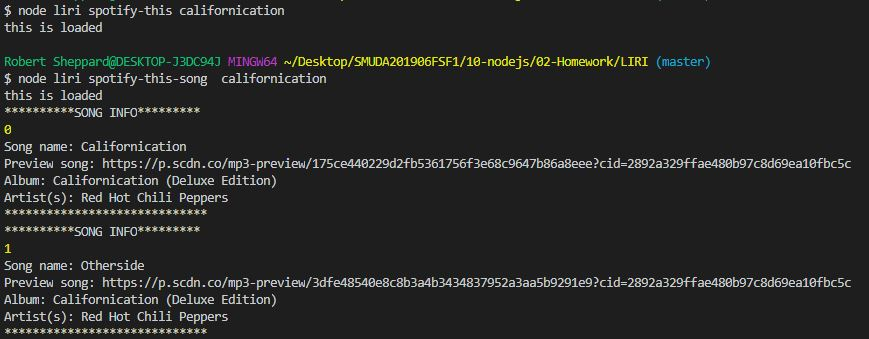
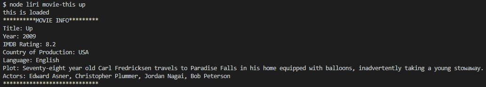
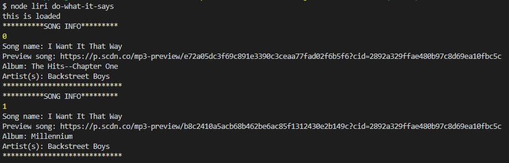

# LIRI Overview

LIRI is functionally similar to Siri. However, whweras SIRI is a Speech Interpretation and Recognision Interface, LIRI is a Language Interpretation and Recognition Interface operated out of the Command Line Inerface (CLI) where the user inputs parameters and the application returns data.

#Functionality

LIRI's current functionality uses a number of Node Package Managers (NPMs) and also communicates with several different Application Program Interfaces (APIs) to pull the requested data:

- Node-Spotify-API
- Axios
- Moment
- DotEnv
- Request
- OMDB API
- Bands In Town API

At this time, LIRIs functionality can be broken up into four main areas:

-concert-this
-spotify-this-song
-movie-this
-do-what-it-says

#concert-this

Command: `node liri.js concert-this <artist/band name here>`

This will search the Bands in Town Artist Events API for an artist and render the following information about each event to the terminal:

- Name of the venue
- Venue location
- Date of the Event (use moment to format this as "MM/DD/YYYY")

#spotify-this-song
Command: `node liri.js spotify-this-song '<song name here>'`

- This will show the following information about the song in your terminal/bash window
  img src

  - Artist(s)
  - The song's name
  - A preview link of the song from Spotify
  - The album that the song is from
  - If no song is provided then your program will default to "The Sign" by Ace of Base.

  

#movie-this
Command: `node liri.js movie-this '<movie name here>'`

- This will output the following information to your terminal/bash window:

  ```
    * Title of the movie.
    * Year the movie came out.
    * IMDB Rating of the movie.
    * Rotten Tomatoes Rating of the movie.
    * Country where the movie was produced.
    * Language of the movie.
    * Plot of the movie.
    * Actors in the movie.
  ```



#do-what-it-says
Command: `node liri.js do-what-it-says`

- Using the `fs` Node package, LIRI will take the text inside of random.txt and then use it to call one of LIRI's commands.

- It should run `spotify-this-song` for "I Want it That Way," as follows the text in `random.txt`.

- Edit the text in random.txt to test out the feature for movie-this and concert-this.


